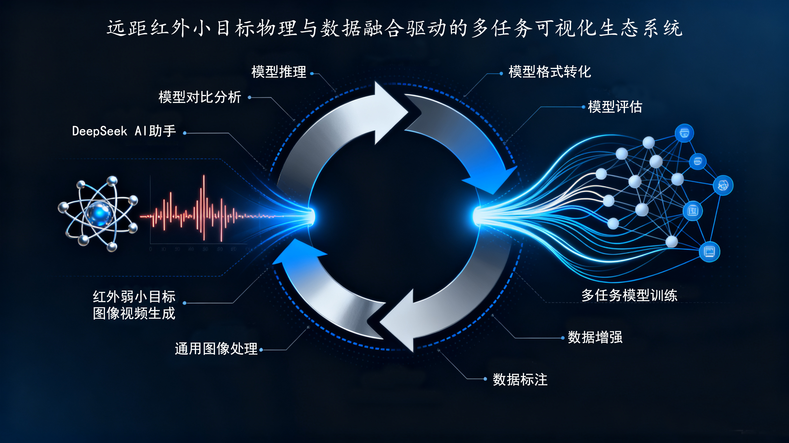
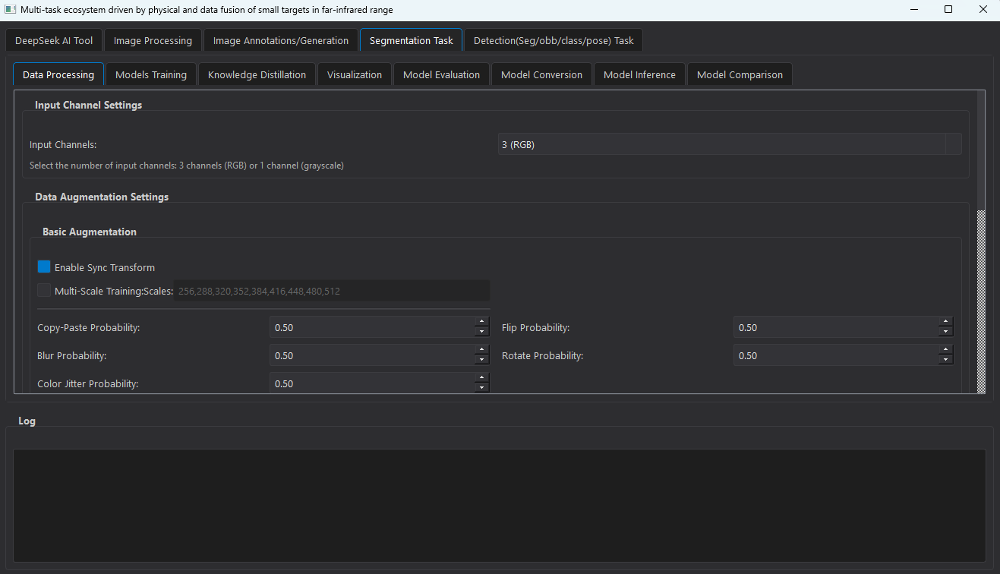

 # Hi, I'm Renke Kou 👋

🌱 **Currently**: Postdoctoral Researcher 

🔭 **Research Focus**: Building an infrared small target ecosystem, including:  

- Image/video generation & annotation  
- Multi-task training & knowledge distillation  
- Evaluation metrics & inference optimization  
- Mobile deployment for infrared weak targets
  

- The first generation web version full stack visualization system has been open sourced, and you can access it https://github.com/kourenke/LW-IRSTNet/tree/main/IRSTD_streamlit Download the source code.

- We are currently dedicated to the research and development of more functional visualization systems.

---

## 🔥 Publications 
### Journal Papers

### - Review papers (综述类)

1. **Kou R K**, Wang C P, Peng Z M, et al.  
   [Infrared small target segmentation networks: A survey](https://doi.org/10.1016/j.patcog.2023.109788)  
   *Pattern Recognition*, 2023, 143: 109788  
   `ESI Highly Cited` `WOS:00103718620000`

2. 寇人可, 王春平, 罗迎, 等.  
   [单帧红外图像多尺度小目标检测技术综述](https://doi.org/10.11834/jig.230788)  
   *中国图象图形学报*, 2024, 29(09):2625-2649

### - Algorithm related papers (算法类)

- Model driven algorithms
  
3. **Kou R K**, Wang C P, Fu Q, et al.  
   [Infrared small target detection based on improved density peak search and human visual mechanism](https://doi.org/10.1109/JSTARS.2022.3193884)  
   *IEEE J-STARS*, 2022, 15: 6144-6157  
   `WOS:000838675100003`

4. Xi Y Q, Liu D Y, **Kou R K**, et al.  
   [Infrared Small Target Detection Based on Holistic Interframe Interaction and Spatiotemporal Local Contrast Method](https://doi.org/10.1109/LGRS.2025.3600996)  
   *IEEE GRSL*, 2025.

- Data driven algorithms

5. **Kou R K**, Wang C P, Yu Y, et al.  
   [LW-IRSTNet: Lightweight infrared small target segmentation network](https://doi.org/10.1109/TGRS.2023.3314586)  
   *IEEE TGRS*, 2023, 61: 5621313  
   `ESI Highly Cited` `WOS:001119655900007`

6. Xi Y Q, Liu D Y, **Kou R K**, et al.  
   [Gradient Enhanced Feature Pyramid Network for Infrared Small Target Detection](https://doi.org/10.1109/LGRS.2025.3546569)  
   *IEEE GRSL*, 2025.

7. 王培超,王家宝,**寇人可**,等.
   [边缘信息增强的轻量化红外小目标检测方法](https://link.cnki.net/urlid/11.2127.tp.20250331.1233.013)  
   *计算机工程与应用*, 2025
   
- Mask label generation algorithm
  
8. **Kou R K**, Wang C P, Fu Q, et al.  
   [MCGC: Multi-scale chain growth clustering for infrared targets under single-point supervision](https://doi.org/10.1109/TGRS.2024.3390756)  
   *IEEE TGRS*, 2024, 62: 5620412  
   `WOS:001214652600004`

9. Yuan S, Qin H L, **Kou R K**, et al.  
   [Beyond full labels: Energy-double-guided single-point prompt for infrared small target label generation](https://doi.org/10.1109/JSTARS.2025.3545014)  
   *IEEE J-STARS*, 2025.

- Tracking algorithm

10. **Kou R K**, Wang C P, Yu Y, et al.  
   [Infrared small target tracking via segmentation network and multistrategy fusion](https://doi.org/10.1109/TGRS.2023.3286836)    
   *IEEE TGRS*, 2023, 61: 5612912  
   `WOS:001022708100018`

11. Song J, Mei W, Xu Y, Fu Q, **Kou R K**, et al.  
   [Motion Estimation for Multi-Object Tracking using KalmanNet with Semantic-Independent Encoding](https://arxiv.org/pdf/2509.11323)  
   *arxiv preprint*, arxiv:2509.11323, 2025.

### - Dataset category (数据集类)

12. https://github.com/kourenke/IRTiny-BD-10K-Datasets

### - Evaluation metrics (评估指标类)

13. https://github.com/IRSTD/STD-EvalKit

### - Analysis of target infrared radiation characteristics (目标红外辐射特性分析类)

14. **Kou R K**, Wang C P, Fu Q, et al.  
   [Detection model and performance evaluation for infrared search and tracking systems](https://doi.org/10.1364/AO.469807)  
   *Applied Optics*, 2023, 62(2): 398-410  
   `WOS:001057810600017`

15. **Kou R K**, Wang H Y, Zhao Z H, et al.  
   [Optimum selection of detection point and threshold noise ratio of airborne infrared search and track systems](https://doi.org/10.1364/AO.56.005268)  
   *Applied Optics*, 2017, 56(18): 5268-5273.
   
---

## 👯 Academic Activities
### Journal Reviewer
- IEEE Transactions on Geoscience and Remote Sensing
- IEEE Journal of Selected Topics in Applied Earth Observations and Remote Sensing
- IEEE Signal Processing Letters
- Computer Science Review
- Remote Sensing
- Engineering Applications of Artificial Intelligence
- 中国图象图形学报

---

  

